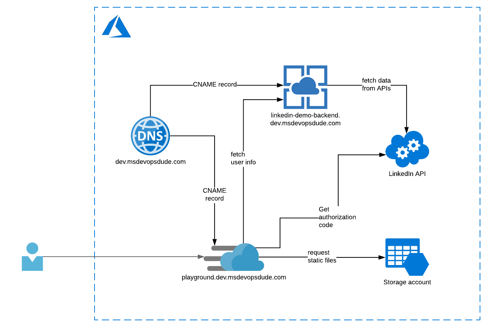

# Backend application (Node.JS + Express) for SPA demo


This is a simple backend app for fetching user's data from LinkedIn API. The client app calls this by providing the needed authorization code since it handles the login part.



## Running the SPA demo locally

***Note 1: You need to create yourself your [own app in LinkedIn Developers](https://docs.microsoft.com/en-us/linkedin/shared/authentication/authorization-code-flow) and configure `Client ID` + `Client Secret` accordingly.*** 

***Note 2: Make sure to also allow `http://localhost:3000` under your LinkedIn App's _OAuth 2.0 settings_ > _Redirect URLs._***

### Configuring your local `.env.development` file

See [RCA documentation](https://create-react-app.dev/docs/adding-custom-environment-variables/) on this for more details.

```bash
$ cat <<EOF > ./client/.env.development
REACT_APP_LINKEDIN_STATE=f1rbha45ft8k96v68o9
REACT_APP_LINKEDIN_REDIRECT_URI=http://localhost:3000
REACT_APP_LINKEDIN_CLIENT_ID=<YOUR_LINKED_IN_APPS_CLIENT_ID>
REACT_APP_BACKEND_URL=http://localhost:9000
EOF
```

### Configuring your local `.env` file

```bash
$ cat <<EOF > .env
LINKEDIN_CLIENT_ID=<YOUR_LINKED_IN_APPS_CLIENT_ID>
LINKEDIN_CLIENT_SECRET=<YOUR_LINKED_IN_APPS_CLIENT_SECRET>
LINKEDIN_REDIRECT_URI=http://localhost:3000
EOF
```

### Running both server and client simultaneously

```bash
# make sure you have local env files configured
npm install
cd client
npm install
cd ..
npm run dev
```

## Building the Docker image and pushing to Docker Hub

```bash
# Sign in to Docker Hub
docker login
docker build -t masahigo/spa-demo-backend .
docker push masahigo/spa-demo-backend
```

## Triggering CD pipeline in Github Actions

```bash
npm run tag:updated
```
