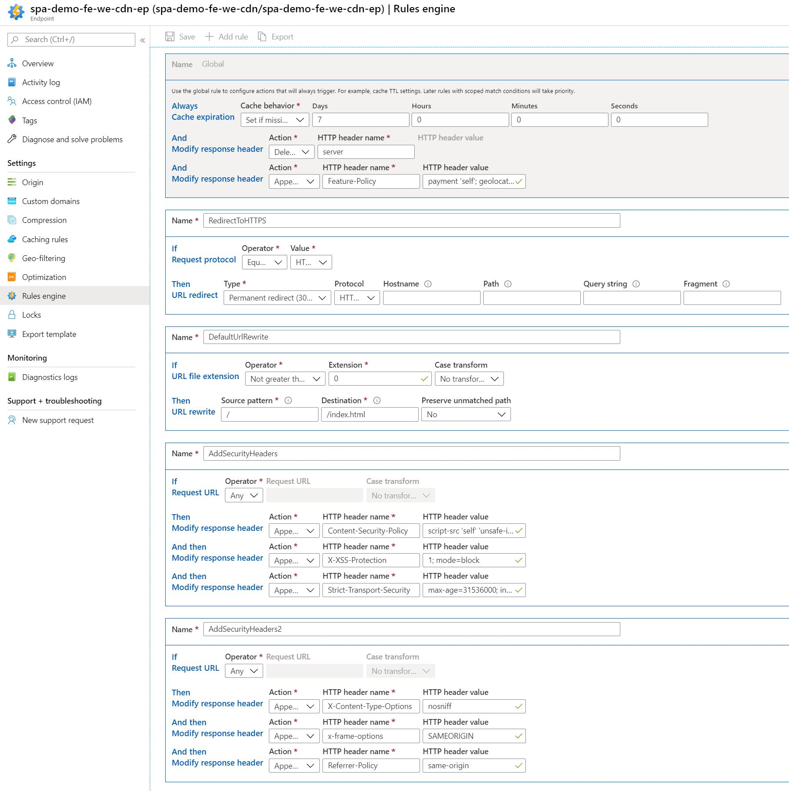

# Security headers



See also [security report](../../presentations/securityheaders-dot-com-https___playground.dev.msdevopsdude.com_.pdf).

```bash
# This is what the correct rules look like
az cdn endpoint rule show -n spa-demo-fe-we-cdn-ep -g spa-demo-we-rg --profile-name spa-demo-fe-we-cdn --query "deliveryPolicy"

{
  "description": "",
  "rules": [
    {
      "actions": [
        {
          "name": "CacheExpiration",
          "parameters": {
            "cacheBehavior": "SetIfMissing",
            "cacheDuration": "7.00:00:00"
          }
        },
        {
          "name": "ModifyResponseHeader",
          "parameters": {
            "headerAction": "Delete",
            "headerName": "server",
            "value": null
          }
        },
        {
          "name": "ModifyResponseHeader",
          "parameters": {
            "headerAction": "Append",
            "headerName": "Feature-Policy",
            "value": "payment 'self'; geolocation 'self';"
          }
        }
      ],
      "conditions": [],
      "name": "Global",
      "order": 0
    },
    {
      "actions": [
        {
          "name": "UrlRedirect",
          "parameters": {
            "customFragment": null,
            "customHostname": null,
            "customPath": null,
            "customQueryString": null,
            "destinationProtocol": "Https",
            "redirectType": "PermanentRedirect"
          }
        }
      ],
      "conditions": [
        {
          "name": "RequestScheme",
          "parameters": {
            "matchValues": [
              "HTTP"
            ],
            "negateCondition": false
          }
        }
      ],
      "name": "RedirectToHTTPS",
      "order": 1
    },
    {
      "actions": [
        {
          "name": "UrlRewrite",
          "parameters": {
            "destination": "/index.html",
            "preserveUnmatchedPath": false,
            "sourcePattern": "/"
          }
        }
      ],
      "conditions": [
        {
          "name": "UrlFileExtension",
          "parameters": {
            "matchValues": [
              "0"
            ],
            "negateCondition": true,
            "operator": "GreaterThan",
            "transforms": []
          }
        }
      ],
      "name": "DefaultUrlRewrite",
      "order": 2
    },
    {
      "actions": [
        {
          "name": "ModifyResponseHeader",
          "parameters": {
            "headerAction": "Append",
            "headerName": "Content-Security-Policy",
            "value": "script-src 'self' 'unsafe-inline'; style-src 'self' 'unsafe-inline' https://fonts.googleapis.com;"
          }
        },
        {
          "name": "ModifyResponseHeader",
          "parameters": {
            "headerAction": "Append",
            "headerName": "X-XSS-Protection",
            "value": "1; mode=block"
          }
        },
        {
          "name": "ModifyResponseHeader",
          "parameters": {
            "headerAction": "Append",
            "headerName": "Strict-Transport-Security",
            "value": "max-age=31536000; includeSubDomains"
          }
        }
      ],
      "conditions": [
        {
          "name": "RequestUri",
          "parameters": {
            "matchValues": [],
            "negateCondition": false,
            "operator": "Any",
            "transforms": []
          }
        }
      ],
      "name": "AddSecurityHeaders",
      "order": 3
    },
    {
      "actions": [
        {
          "name": "ModifyResponseHeader",
          "parameters": {
            "headerAction": "Append",
            "headerName": "X-Content-Type-Options",
            "value": "nosniff"
          }
        },
        {
          "name": "ModifyResponseHeader",
          "parameters": {
            "headerAction": "Append",
            "headerName": "x-frame-options",
            "value": "SAMEORIGIN"
          }
        },
        {
          "name": "ModifyResponseHeader",
          "parameters": {
            "headerAction": "Append",
            "headerName": "Referrer-Policy",
            "value": "same-origin"
          }
        }
      ],
      "conditions": [
        {
          "name": "RequestUri",
          "parameters": {
            "matchValues": [],
            "negateCondition": false,
            "operator": "Any",
            "transforms": []
          }
        }
      ],
      "name": "AddSecurityHeaders2",
      "order": 4
    }
  ]
}
```